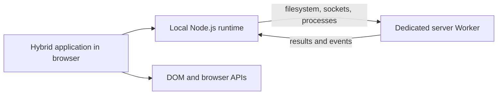

# Lumiana

Lumiana lets a Vite application use Node.js and the DOM together.

Application code keeps ordinary Node imports, objects, constructors, callbacks, streams, and
events. JavaScript behavior runs in the browser whenever it can. Operations that require the host
operating system are executed by a dedicated Node.js Worker and returned through the Lumiana
connection.



This means a library can retain its normal JavaScript identity in the browser while its file
handles, listening sockets, child processes, and native implementations remain on the server.

## How execution is divided

Lumiana divides behavior by capability rather than by package name:

- JavaScript values, module objects, constructors, callbacks, streams, event emitters, timers,
  hashing, compression, and stable process information stay in the browser.
- File handles, listeners, sockets, child processes, and other operating-system resources live in
  the connection's Worker.
- Asynchronous commands and events use the existing binary MessagePack WebSocket.
- Synchronous Node operations remain synchronous and cross the boundary once when they require the
  Worker.
- Unsupported native values are represented by references that preserve their owner and identity.

Packages are bundled by default. Importing a Node builtin does not make a package external because
the package can consume Lumiana's browser-owned implementation of that builtin. A dependency stays
on the server only when build analysis proves that it cannot be bundled, or when the user excludes
it explicitly.

There is no package allowlist.

## Requirements

- Node.js 22.18 or newer on the 22.x line, or Node.js 24.11 or newer
- Vite 5, 6, 7, or 8

Install Lumiana in the Vite application:

```sh
npm install lumiana
```

## Basic usage

Add the plugin to `vite.config.ts`:

```ts
import { defineConfig } from 'vite';
import { lumiana } from 'lumiana';

export default defineConfig({
  plugins: [lumiana()],
});
```

Establish the connection before loading application modules that use Node capabilities:

```ts
// main.ts
import { connect } from 'lumiana/client';

const lumiana = await connect.credentials({
  username: 'lumiana',
  password: 'lumiana',
});

await import('./app');
console.log(await lumiana.status());
```

The application itself uses normal imports:

```ts
// app.ts
import { hostname, platform } from 'node:os';

document.body.textContent = `Connected to ${hostname()} on ${platform()}`;
```

`hostname()` and `platform()` use the stable operating-system snapshot received during connection,
so this example updates the DOM without another network request.

ES module imports execute before the importing module body. The dynamic import in `main.ts`
therefore guarantees that the connection exists before `app.ts` runs. The application does not
need a special filename or directory.

## Client API

Import the browser API from `lumiana/client`:

```ts
import { lumiana, connect, node, Buffer } from 'lumiana/client';
```

### `await connect.credentials(credentials)`

Establishes the single Lumiana connection for the browser context and returns the existing
`lumiana` instance.

```ts
const instance = await connect.credentials({
  username: 'lumiana',
  password: 'lumiana',
  url: 'https://application.example', // optional
});
```

- The instance exists before connection, but interacting with it before connection throws.
- Repeating the same connected call returns the same instance.
- A concurrent connection attempt throws.
- Attempting a different connection while one is active throws.
- After disconnection, the same instance can connect again.

When `url` is omitted, Lumiana connects through the page origin and respects Vite's base path.

### `await lumiana.status()`

Returns the main server status and the measured connection latency:

```ts
const status = await lumiana.status();

console.log(status.mode);
console.log(status.version);
console.log(status.connections);
console.log(status.latency);
```

The result contains the server PID, uptime, mode, Node version, platform, memory usage, active
connection count, server time, and latency.

### `lumiana.disconnect()`

Closes the connection, stops its dedicated Worker, rejects pending operations, and invalidates
remote references. If the Worker stops first, the browser connection closes as well.

### `node(specifier)`

Explicitly resolves a native module through the connected Worker's Node resolver:

```ts
import { node } from 'lumiana/client';
import { tmpdir } from 'node:os';

const fs = node<typeof import('node:fs')>('node:fs');
const exists = fs.existsSync(tmpdir());
```

`node()` can be called from any application module and throws when Lumiana is not connected. Normal
Node imports remain the preferred form; `node()` is available when native resolution must be
selected explicitly.

### `Buffer`

Lumiana exports the browser runtime's Node-compatible `Buffer`. Binary values cross the connection
as bytes through MessagePack rather than being converted to text.

## Plugin configuration

```ts
import { lumiana } from 'lumiana';

lumiana({
  defaultCredentials: {
    username: 'my-user',
    password: 'my-password',
  },
  nodeModules: ['native-package', /^@company\/native-/],
});
```

### `defaultCredentials`

Defines the credentials used by the development server, Vite preview, and standalone production.
The defaults are `lumiana` / `lumiana`.

Environment variables take precedence:

- `LUMIANA_USERNAME`
- `LUMIANA_PASSWORD`

Credentials protect initial connection establishment. After authentication, messages route
directly to that connection's Worker without per-operation allowlists.

### `nodeModules`

Explicitly excludes matching packages from the browser build. Entries may be exact package names
or regular expressions.

Every other package is bundled unless resolution or build analysis proves that it requires native
execution. Native addons and other genuinely non-bundlable implementations remain server-owned.
Dependency modules that request Node export conditions receive them without changing unrelated
imports in the application's composition modules.

## Hybrid browser APIs

Unqualified `fetch` and `WebSocket` use hybrid routing:

- Same-origin requests execute in the browser.
- Requests to another origin execute through native networking.
- Relative URLs resolve against the page.
- `ws:` is compared with `http:`, and `wss:` with `https:`.

Explicit `window.fetch` and `window.WebSocket` always retain their browser implementations.
Functions imported from a Node library retain that library's implementation. Locally declared
bindings named `fetch` or `WebSocket` are not transformed.

## Values and references

Primitives and plain records cross by value. Plain records may contain cycles.

Functions, arrays, class instances, symbols, and other non-plain values retain references to their
owner. Passing a reference back restores the original value and identity. Promise settlement is
mirrored into a local Promise while its native identity remains available for return trips.

References live until the connection ends. Server logs, standard output, standard error, and
uncaught errors are projected into the browser console.

## Node runtime support

Lumiana currently provides browser-owned contracts for:

- `node:fs`, including callback, Promise, synchronous, stream, and watcher forms
- `node:net`, including TCP and Unix sockets
- the server half of `node:http`
- `node:child_process`, including local streams and lifecycle events
- `node:os` and local stable system information
- `node:crypto` and `node:zlib`
- `node:module`, including source-relative `createRequire()`
- `node:stream/promises`
- `node:timers`
- `node:url` and `node:util`
- portable modules such as `assert`, `buffer`, `events`, `path`, `querystring`,
  `string_decoder`, and streams

Child processes, file watchers, connections, and listeners expose browser-owned objects while the
Worker keeps their operating-system handles. `process.env`, `homedir()`, and `platform()` are local
connection snapshots and make no request when read or serialized.

Facades for `node:tty`, `node:perf_hooks`, `node:v8`, `node:vm`, `node:https`, `node:http2`, and
`node:tls` keep supported JavaScript behavior local and delegate remaining native operations.

Static missing optional dependencies are recorded during the build. A local `createRequire()` then
throws `MODULE_NOT_FOUND` without contacting the server, allowing the package's own fallback logic
to run normally.

## Running and deployment

Run the Vite application normally during development:

```sh
npm run dev
```

Preview the production build with Vite:

```sh
npm run build
npm run preview
```

`vite build` creates:

```text
dist/
├── public/       browser application
├── server/       Lumiana host and Worker runtime
├── main.mjs      standalone entry
└── package.json  production dependencies and start command
```

For a standalone deployment:

```sh
cd dist
bun install --production
bun run start
```

The standalone server uses `LUMIANA_HOST` and `LUMIANA_PORT`, defaulting to `127.0.0.1` and `3883`.
Vite development and preview continue to use Vite's normal host and port configuration. Vite also
controls application minification through `build.minify`.

## Runtime constraints

Network latency still exists when an operation crosses the boundary. A synchronous operation on an
unsupported native reference uses synchronous XHR with MessagePack data; asynchronous reference
and kernel traffic uses the binary WebSocket.

A remote reference is a JavaScript proxy. Owner methods and constructors preserve their native
receivers, but browser intrinsics cannot acquire another process's private engine slots. For
example, call `remoteMap.get(key)` instead of `Map.prototype.get.call(remoteMap, key)`.

Synchronous module loading retains Node's restriction on modules with top-level asynchronous
initialization. Use asynchronous `import()` for those modules. `vm.runInThisContext()` evaluates in
the browser global realm; separate Node VM context semantics remain incomplete.

These are consequences of the process and network boundary. Lumiana keeps them visible instead of
adding package-specific behavior or caching mutable reflection to conceal them.

## Repository development

This section is for contributors working on Lumiana itself.

The repository uses Bun for package management and Node.js for runtime execution:

```sh
bun install
bun run build
bun run typecheck
bun run test
```

To run the linked example from this checkout:

```sh
bun link
cd example
bun install
bun run dev
```

The playground has separate dependencies. Run `bun install` inside `playground` before using its
scripts.
